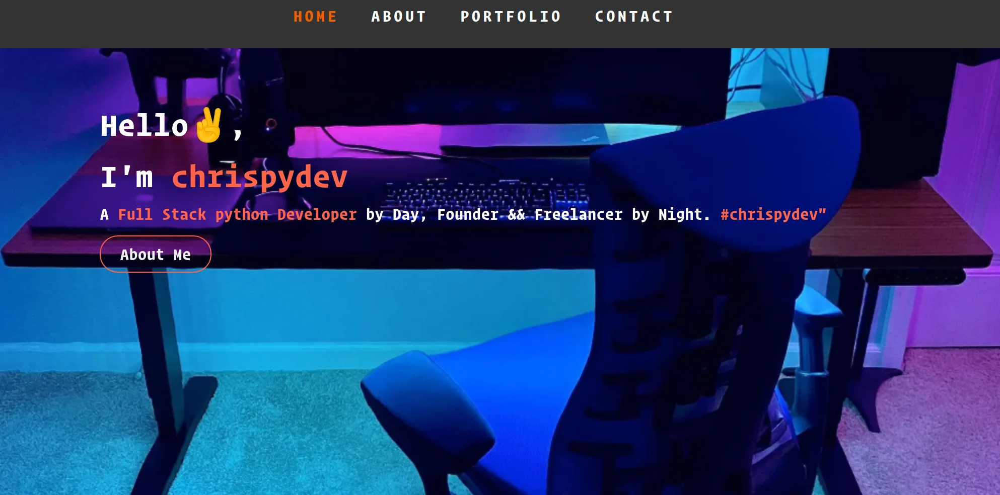

## Available Scripts

In the project directory, you can run:

### `npm install`

### `npm start`

technologies used
### `font awesome`
### `react bootstraps`

Runs the app in the development mode. 
Open [http://localhost:3000](http://localhost:3000) to view it in the browser.

The page will reload if you make changes. 
You will also see any lint errors in the console.
